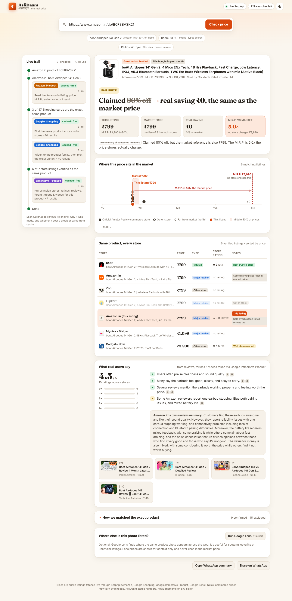

# AsliDaam: असली दाम, *the real price*

**Is that festive "80% off" real?** Paste an Amazon.in link or type a product. AsliDaam finds the **same exact product** across Indian stores using live SerpApi data. It works out what the market actually charges and shows your **real saving** next to the claimed one. Every price links to its source.

> SerpApi India Hackathon 2026 · Track: **Commerce & Market Intelligence**



## The problem

During Big Billion Days and the Great Indian Festival, almost every listing shows 50–80% off. Shoppers can't tell a real deal from an inflated M.R.P.:

> *"In the name of sale they are selling items at much higher prices by giving fake discount on inflated MRP."* ([DesiDime](https://www.desidime.com/discussions/the-big-billion-bluff))

- **Survey evidence:** in a LocalCircles survey of 54k shoppers, 56% had seen positively biased ratings.
- **Gap in existing tools:**
  - Price trackers (Keepa, PriceHistory, BuyHatke) follow one product on one store.
  - None of them says what the rest of the market charges for the same item today.
  - None of them checks the M.R.P.

**A live example (8 Oct 2026, from the app):**
- Amazon.in sells *boAt Airdopes 141 Gen 2* at **₹799**, showing "−80%" against an **M.R.P. of ₹3,990**, under a *Great Indian Festival* badge.
- AsliDaam found the same product at boAt.com, Zop and Myntra. The market price is **₹799**.
- **Real saving: ₹0.** The M.R.P. is **5.0×** what any store charges.

## What it does

| | |
|---|---|
| **Same exact product** | Strict rules (brand, model number, variant words, RAM/storage, refurbished) plus an AI resolver separate *Airdopes 141 Gen 2* from *141*, *141 ANC*, *141 Elite*, *141 Pro*, cases and skins. They also separate *Redmi 13 5G* from *Redmi Note 13*. Every exclusion is shown with its reason. |
| **Market price, computed** | Trimmed median of in-stock, independent stores. The listing being judged never counts toward its own reference. **No number is generated by the AI.** |
| **Real saving vs claimed** | `Claimed 80% off → real saving ₹0`. M.R.P. multiple. Verdict: *Good deal / Fair price / Above market / Not enough data*. |
| **Price number line** | Every store as a dot, the middle-50% band, the listing, and the M.R.P. sitting far out on its own. |
| **Honest about thin data** | Fewer than 3 clean stores gives "Not enough data", never a guess. Quick-commerce prices are labelled "may vary by pincode". Prices far below the market are flagged "verify seller" and never called "fake". |
| **What real users say** | Cross-store rating distribution plus an AI summary of user reviews, Reddit/forum threads and YouTube reviews. Every bullet is cited. |
| **Photo provenance** *(optional)* | Google Lens shows where the same product photo is listed (+1 credit, only on click). |
| **Live SerpApi trail** | Every call shows engine, purpose, time, and whether it cost a credit or came from cache. |

## How SerpApi powers it

SerpApi is the product's only data source. Without it there are no prices, stores, M.R.P., reviews or photos.

| Engine | Used for |
|---|---|
| `amazon_product` (`amazon_domain=amazon.in`) | Read a pasted Amazon.in link: price, **M.R.P.**, seller, badges, bank offers, rating, review summary |
| `amazon` (`amazon_domain=amazon.in`) | Find the listing for a typed product name |
| `google_shopping` (`gl=in`, `google.co.in`) | Candidate product cards across Indian merchants. A second "product family" query widens the search when Google's wording misses the exact variant. |
| `google_immersive_product` (`more_stores=true`) | Up to 13 stores for the exact product, plus rating distribution, user reviews, forum threads and YouTube reviews. Many signals for one credit. |
| `google_lens` (`country=in`) | Optional: where else the product photo is listed |
| Account API | Free credits-left counter in the header |

**Credit discipline:**
- 3 credits per check, 4 if the family fallback is needed, with a hard per-check budget.
- On-disk cache (24 h) on top of SerpApi's own 1-hour cache.
- Replay mode spends nothing.
- A server-wide hourly cap on live searches.
- API calls from other websites are rejected.
- Lens only accepts Amazon/Google product-image URLs.

## Quick start

Requires [uv](https://docs.astral.sh/uv/). Python 3.12 is fetched automatically.

```bash
git clone https://github.com/LoheshM/aslidaam.git && cd aslidaam
uv sync
cp .env.example .env        # add your keys (optional, see below)
uv run uvicorn app.main:app --port 8000
# open http://localhost:8000
```

| Variable | Needed? | Notes |
|---|---|---|
| `SERPAPI_API_KEY` | For live checks | Free plan works (250 searches/month) |
| `OPENAI_API_KEY` | Recommended | Same-product resolver and summary. Without it, rules-only matching and a template summary are used. |
| `OPENAI_MODEL` | No | Default `gpt-5.4-mini` |
| `ASLIDAAM_MODE` | No | `auto` (cache first, then live), `live`, or `replay` |
| `ASLIDAAM_CREDITS_PER_CHECK` | No | Default 4 |
| `ASLIDAAM_LIVE_PER_HOUR` | No | Server-wide cap on billed searches per hour (default 40). Beyond it, cached results only. |

**No keys? It still runs.**
- With no `SERPAPI_API_KEY`, the app switches to **replay mode**.
- The three example chips play back recorded SerpApi and OpenAI responses from `data/fixtures/`, one for each verdict type.
- Recorded fixtures contain no API keys.

CLI: `uv run python -m scripts.check "https://www.amazon.in/dp/B0F8BVSK21"` prints the whole event stream.

## Architecture

```
browser (vanilla JS + SVG, no build step)
  │ EventSource /api/check/stream?q=…
FastAPI ─ pipeline.run()  ──streams events──►  step · serp_call · anchor · match · market · voices · summary · done
   ├─ parse      classify input (Amazon URL → ASIN, store URL → slug, text), parse ₹ prices
   ├─ SerpClient cache · replay fixtures · per-check credit budget · call log
   ├─ resolve    rules (accessory/reseller/model/variant/storage) → 1 batched LLM call (strict JSON)
   ├─ market     trimmed median, band, outliers, verdict: pure code, unit-tested
   └─ llm        narrative from computed facts only; cites source ids; neutral wording enforced
```

**Notable design decisions** (debated in [docs/IDEA_ITERATIONS.md](docs/IDEA_ITERATIONS.md)):
- **Find the exact variant before opening a product page.** An early probe compared Gen 2 against the original 141 by mistake.
- **SerpApi's `extracted_old_price` parses `"80% off₹3,990"` as `80`.** We parse the raw `old_price` string ourselves, with a test for it.
- **Prices from a seller's own marketplace never count toward that listing's reference.**
- **Neutral language.** The M.R.P. is set by the brand under Legal Metrology rules, so AsliDaam states numbers and never accuses sellers.

## Tests

```bash
uv run pytest -q          # unit + replay end-to-end + API tests, no network
uv run python -m scripts.ui_shot http://localhost:8000 docs/screenshots   # UI smoke via Playwright (Edge/Chrome)
```

## Demo script (under 3 minutes)

1. **0:00** Landing: "Is that 80% off real?"
2. **0:10** Paste the Amazon.in link for *boAt Airdopes 141 Gen 2*. The live trail shows Amazon Product, Google Shopping and Immersive Product calls ticking by.
3. **0:40** The verdict: **Claimed 80% off → real saving ₹0**. On the number line, the M.R.P. sits at 5.0× the market.
4. **1:10** The store table: boAt.com, Zop and Myntra around the same price, Flipkart out of stock, a ₹3,890 listing flagged "well above market".
5. **1:30** "How we matched": 40+ look-alikes excluded with reasons (ANC, Elite, Pro, cases).
6. **1:50** Typed search *Redmi 13 5G 8GB 128GB*. The Amazon listing is ₹23,999 against a market of about ₹13k, so the verdict is **Above market**.
7. **2:20** *Philips HD9252/70*: **Not enough data**, the honest answer. Then the Lens button and the WhatsApp share.

## Limitations

- **Not a price-history tracker.** AsliDaam cannot detect pre-sale price hikes. It compares against today's market.
- **Location-dependent prices.** Google Shopping and quick-commerce prices can depend on location.
- **Bank offers** are shown as listed. Eligibility isn't verified, so they aren't subtracted.

## AI tools disclosure

- **Built with Claude Code (Anthropic, Claude Opus).** Used for pain-point research, idea debate (including an adversarial "judge" review), architecture, code, tests, UI and code review. All output was reviewed and directed by the author.
- **Inside the product:** OpenAI `gpt-5.4-mini` for same-product resolution and the plain-language summary. All prices and percentages are computed in code.

## Licence

MIT. See [LICENSE](LICENSE). Product names and prices belong to their respective owners. AsliDaam displays public search results for comparison.
