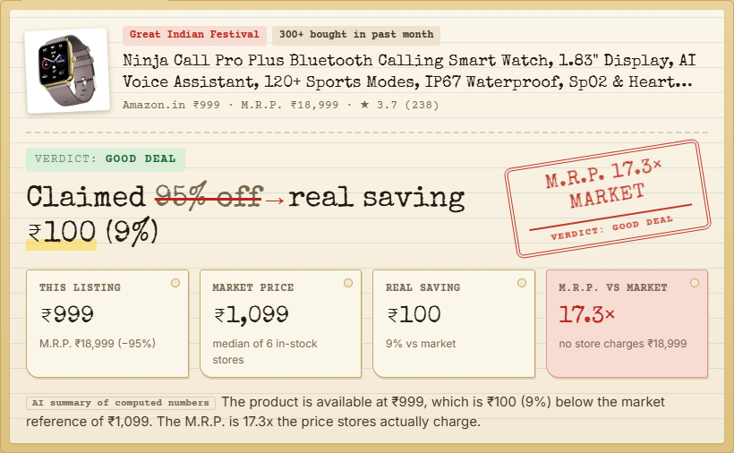

# Dealtective: the deal detective

**Is that festive "80% off" real?** Paste an Amazon.in link or type a product. Dealtective finds the **same exact product** across Indian stores using live SerpApi data. It works out what the market actually charges and shows your **real saving** next to the claimed one. Every price links to its source.

> SerpApi India Hackathon 2026 · Track: **Commerce & Market Intelligence**



*The UI is a detective's case file: the listing goes in as Exhibit A, the stores are lined up, the market price is computed, and the verdict is rubber-stamped.*

## The problem

During Big Billion Days and the Great Indian Festival, almost every listing shows 50–80% off. Shoppers can't tell a real deal from an inflated M.R.P.:

> *"In the name of sale they are selling items at much higher prices by giving fake discount on inflated MRP."* ([DesiDime](https://www.desidime.com/discussions/the-big-billion-bluff))

- **Survey evidence:** in a LocalCircles survey of 54k shoppers, 56% had seen positively biased ratings.
- **Gap in existing tools:**
  - Price trackers (Keepa, PriceHistory, BuyHatke) follow one product on one store.
  - None of them says what the rest of the market charges for the same item today.
  - None of them checks the M.R.P.

**Live examples (8–9 Oct 2026, from the app):**
- Amazon.in lists the *Fire-Boltt Ninja Call Pro Plus* smartwatch at **₹999, "−95%" off an M.R.P. of ₹18,999**, under a *Great Indian Festival* badge. Dealtective finds 6 in-stock Indian stores selling it at a median of **₹1,099**.
  - **Real saving: ₹100**, against a claimed 95%.
  - The M.R.P. is **17.3×** what stores charge.
  - Flipkart lists the same watch with an M.R.P. of **₹9,999** (PriceBefore, 9 Oct), so the "original price" differs by store.
- Amazon.in sells *boAt Airdopes 141 Gen 2* at **₹799**, showing "−80%" against an **M.R.P. of ₹3,990**, under a *Great Indian Festival* badge.
- Dealtective found the same product at boAt.com, Zop and Myntra. The market price is **₹799**.
- **Real saving: ₹0.** The M.R.P. is **5.0×** what any store charges.

## What it does

| | |
|---|---|
| **Same exact product** | Strict rules (brand, model number, variant words, RAM/storage, refurbished) plus an AI resolver separate *Airdopes 141 Gen 2* from *141*, *141 ANC*, *141 Elite*, *141 Pro*, cases and skins. They also separate *Redmi 13 5G* from *Redmi Note 13*. Every exclusion is shown with its reason. |
| **Market price, computed** | Trimmed median of in-stock, independent stores. The listing being judged never counts toward its own reference. **No number is generated by the AI.** |
| **Real saving vs claimed** | `Claimed 80% off → real saving ₹0`. M.R.P. multiple. Verdict: *Good deal / Fair price / Above market / Not enough data*. |
| **Price number line** | Every store as a dot, the middle-50% band, the listing, and the M.R.P. sitting far out on its own. |
| **Honest about thin data** | Fewer than 3 clean stores gives "Not enough data", never a guess. Quick-commerce prices are labelled "may vary by pincode". Prices far below the market are flagged "verify seller" and never called "fake". |
| **What real users say** | Cross-store rating distribution plus an AI summary of user reviews, Reddit/forum threads and YouTube reviews. Every bullet is cited. |
| **Photo provenance** *(optional)* | Google Lens shows where the same product photo is listed (+1 credit, only on click). |
| **Live SerpApi trail** | Every call shows engine, purpose, time, and whether it cost a credit or came from cache. |

## How SerpApi powers it

SerpApi is the product's only data source. Without it there are no prices, stores, M.R.P., reviews or photos.

| Engine | Used for |
|---|---|
| `amazon_product` (`amazon_domain=amazon.in`) | Read a pasted Amazon.in link: price, **M.R.P.**, seller, badges, bank offers, rating, review summary |
| `amazon` (`amazon_domain=amazon.in`) | Find the listing for a typed product name |
| `google_shopping` (`gl=in`, `google.co.in`) | Candidate product cards across Indian merchants. A second "product family" query widens the search when Google's wording misses the exact variant. |
| `google_immersive_product` (`more_stores=true`) | Up to 13 stores for the exact product, plus rating distribution, user reviews, forum threads and YouTube reviews. Many signals for one credit. |
| `google_lens` (`country=in`) | Optional: where else the product photo is listed |
| Account API | Free credits-left counter in the header |

**Credit discipline:**
- 3 credits per check, 4 if the family fallback is needed, with a hard per-check budget.
- On-disk cache (24 h) on top of SerpApi's own 1-hour cache.
- Replay mode spends nothing.
- A server-wide hourly cap on live searches.
- API calls from other websites are rejected.
- Lens only accepts Amazon/Google product-image URLs.

## Quick start

Requires [uv](https://docs.astral.sh/uv/). Python 3.12 is fetched automatically.

```bash
git clone https://github.com/LoheshM/dealtective.git && cd dealtective
uv sync
cp .env.example .env        # add your keys (optional, see below)
uv run uvicorn app.main:app --port 8000
# open http://localhost:8000
```

| Variable | Needed? | Notes |
|---|---|---|
| `SERPAPI_API_KEY` | For live checks | Free plan works (250 searches/month) |
| `GEMINI_API_KEY` | Recommended (free tier) | Same-product resolver and summary. Get a free key at [aistudio.google.com](https://aistudio.google.com/apikey). Without an LLM key, rules-only matching and a template summary are used. |
| `OPENAI_API_KEY` | Alternative | Use OpenAI instead of Gemini |
| `LLM_PROVIDER` | No | `gemini` or `openai`. Defaults to whichever key is set. |
| `LLM_MODEL` | No | Defaults: `gemini-2.5-flash` / `gpt-5.4-mini` |
| `DEALTECTIVE_MODE` | No | `auto` (cache first, then live), `live`, or `replay` |
| `DEALTECTIVE_CREDITS_PER_CHECK` | No | Default 5 |
| `DEALTECTIVE_LIVE_PER_HOUR` | No | Server-wide cap on billed searches per hour (default 40). Beyond it, cached results only. |

**No keys? It still runs.**
- With no `SERPAPI_API_KEY`, the app switches to **replay mode**.
- The five example chips play back recorded SerpApi and Gemini responses from `data/fixtures/`, covering every verdict type.
- Recorded fixtures contain no API keys.

CLI: `uv run python -m scripts.check "https://www.amazon.in/dp/B0F8BVSK21"` prints the whole event stream.

## Architecture

```
browser (vanilla JS + SVG, no build step)
  │ EventSource /api/check/stream?q=…
FastAPI ─ pipeline.run()  ──streams events──►  step · serp_call · anchor · match · market · voices · summary · done
   ├─ parse      classify input (Amazon URL → ASIN, store URL → slug, text), parse ₹ prices
   ├─ SerpClient cache · replay fixtures · per-check credit budget · call log
   ├─ resolve    rules (accessory/reseller/model/variant/storage) → 1 batched LLM call (strict JSON)
   ├─ market     trimmed median, band, outliers, verdict: pure code, unit-tested
   └─ llm        narrative from computed facts only; cites source ids; neutral wording enforced
```

**Notable design decisions** (debated in [docs/IDEA_ITERATIONS.md](docs/IDEA_ITERATIONS.md)):
- **Find the exact variant before opening a product page.** An early probe compared Gen 2 against the original 141 by mistake.
- **SerpApi's `extracted_old_price` parses `"80% off₹3,990"` as `80`.** We parse the raw `old_price` string ourselves, with a test for it.
- **Prices from a seller's own marketplace never count toward that listing's reference.**
- **Neutral language.** The M.R.P. is set by the brand under Legal Metrology rules, so Dealtective states numbers and never accuses sellers.

## Store coverage (tested with real links, 8 Oct 2026)

SerpApi has engines for Amazon and Google, not for every Indian store. For other stores, Dealtective reads the listing's price through Google:
1. **Google's index of that exact page** (`site:` search, matched by URL or listing id).
2. Otherwise, **the store's own Google Shopping entry**.

A near-match listing counts only when Google gives a structured price for it.

We tested one real product link from each store against prices checked by hand:

| Store | Listing price read? | Tested product: Dealtective vs actual |
|---|---|---|
| Amazon.in | ✅ Amazon Product API | Airdopes 141 Gen 2 ₹799 / M.R.P. ₹3,990 ✓ |
| Flipkart | ✅ Google index / Shopping | ASICS Noosa Tri 16 ₹5,899 (index; live ₹5,039) · Sony WH-1000XM5 ₹20,499 (live ₹19,990) |
| Reliance Digital | ✅ exact page | Sony WH-1000XM5 **₹31,990 ✓** → "above market", cheaper at Croma |
| Tata CLiQ | ✅ via Shopping | JBL Tune 770NC **₹6,299 ✓** |
| Nykaa | ✅ via Shopping | Maybelline Fit Me **₹509 ✓** |
| boAt.com (brand store) | ✅ via Shopping | Airdopes 141 **₹799 ✓**; bigbasket ₹669 is cheaper |
| Croma, Myntra, AJIO, Vijay Sales, JioMart, Meesho, Snapdeal | ⚠️ market only | Google returned no readable product page for these links (other sites, category pages, or not indexed). Dealtective says it couldn't read the listing and still shows the market. Example: JBL Tune 770NC ≈ ₹4,799, which matches Amazon and Flipkart. |

**Rules for prices Dealtective can't read itself:**
- A price read from Google's index is labelled *"the live price may differ"*.
- Overseas resellers, B2B directories, price-tracker sites and refurbished-only sellers are shown but never counted in the market price.

## Verified against the web

**How we checked:**
- We ran 7 real products through Dealtective on 8–9 Oct 2026, during the Great Indian Festival and Big Billion Days sales.
- Independent agents checked every number against price trackers and retailer pages: pricehistoryapp, pricebefore, price-history.in, Smartprix and brand stores.
- The first round found real bugs: an accessory picked as the product, overseas resellers in the market price, and a wrong fallback model. All are fixed and covered by regression tests.

Final results:

| Product | Dealtective says | Web evidence | |
|---|---|---|---|
| Fire-Boltt Ninja Call Pro Plus (typed) | Amazon ₹999 "−95%" vs M.R.P. ₹18,999 → **good deal, real saving ₹100**; market ₹1,099 (6 stores); M.R.P. **17.3×** market | Flipkart ₹999–1,299 by colour, M.R.P. ₹9,999 (PriceBefore, 9 Oct); DesiDime deal posts show Amazon ₹999–1,099 vs ₹18,999–19,999 | ✅ |
| boAt Airdopes 141 Gen 2 (Amazon link) | ₹799, claims 80% off ₹3,990 → **fair price, real saving ₹0**, M.R.P. 5× market; same price at boAt.com | Flipkart ₹799 / M.R.P. ₹3,990 (price-history.in, 8 Oct); boAt store ₹799 | ✅ |
| Sony WH-1000XM5 | Amazon ₹19,989 → **good deal**, 19% below market; same price at Flipkart | Amazon ₹19,989, Flipkart ₹19,990, Croma ₹22,990; ₹19,989 is the all-time low (pricehistoryapp, 8 Oct) | ✅ |
| Redmi 13 5G 8/128 | Amazon listing ₹23,999 → **₹11,000 above market** (≈₹13k); Mi.com ₹12,499 cheaper | Market ₹12.5–14.5k (Bajaj Finserv, myG, Supreme Mobiles) | ✅ |
| boAt Rockerz 450 | No plain Rockerz 450 on Amazon (only the *Plus 450 ANC*); market ≈ ₹1,649 | ₹1,299–1,899 (Smartprix, CashKaro) | ✅ |
| Apple iPhone 15 128GB | Amazon ₹74,900; **not enough data** (Google Shopping India returned only imports, refurbished units and junk, all excluded) | Amazon ₹74,900 (pricehistoryapp, 7 Oct); Croma/Reliance ₹59,900 are not in Google Shopping's results | ✅ honest |
| Philips HD9252/70 | Amazon ₹7,780 / M.R.P. ₹11,995; **not enough data** (2 stores) | Amazon ₹7,780 / ₹11,995 (pricebefore, 8 Oct) | ✅ honest |
| OnePlus Nord CE4 Lite 8/128 | **Not enough data**: Amazon search returns only cases and screen guards; Shopping returns other models and refurbished units | Phone sold at Croma ₹17,999 / Flipkart ~₹16.6k; Amazon listing stale | ✅ honest |

**What "honest" means here:**
- When Google Shopping India doesn't carry the major retailers for a product, Dealtective says so rather than inventing a market price.
- That is a limit of the search results, not a guess.

## Tests

```bash
uv run pytest -q          # unit + replay end-to-end + API tests, no network
uv run python -m scripts.ui_shot http://localhost:8000 docs/screenshots   # UI smoke via Playwright (Edge/Chrome)
```

## Limitations

- **Not a price-history tracker.** Dealtective cannot detect pre-sale price hikes. It compares against today's market.
- **Location-dependent prices.** Google Shopping and quick-commerce prices can depend on location.
- **Bank offers** are shown as listed. Eligibility isn't verified, so they aren't subtracted.

## AI tools disclosure

- **Built with Claude Code (Anthropic, Claude Opus).** Used for pain-point research, idea debate (including an adversarial "judge" review), architecture, code, tests, UI and code review. All output was reviewed and directed by the author.
- **Inside the product:** Google Gemini `gemini-2.5-flash` (free tier) or OpenAI `gpt-5.4-mini`, used for same-product resolution and the plain-language summary. All prices and percentages are computed in code.

## Licence

MIT. See [LICENSE](LICENSE). Product names and prices belong to their respective owners. Dealtective displays public search results for comparison.
